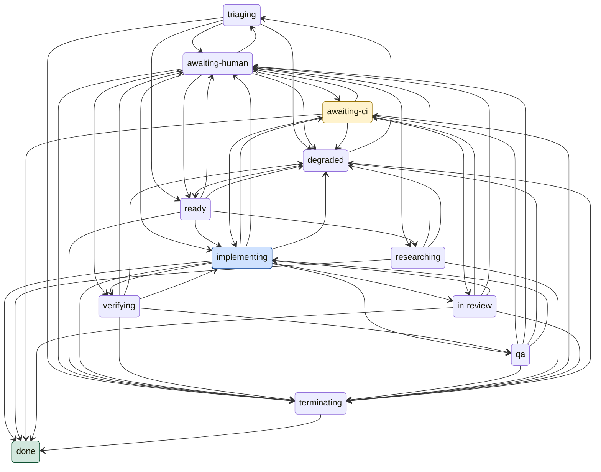

<!-- GENERATED by `make diagram` (maestro/diagram.py) -- DO NOT EDIT. -->

# maestro state machine

Derived from `maestro/statemachine.py` (`TRANSITIONS`, `SLEEPING_PHASES`, `TERMINAL_PHASES`, `ACTIVE_PHASES`) -- regenerate with `make diagram` after touching that file; `tests/test_diagram.py` fails `make test` otherwise.

